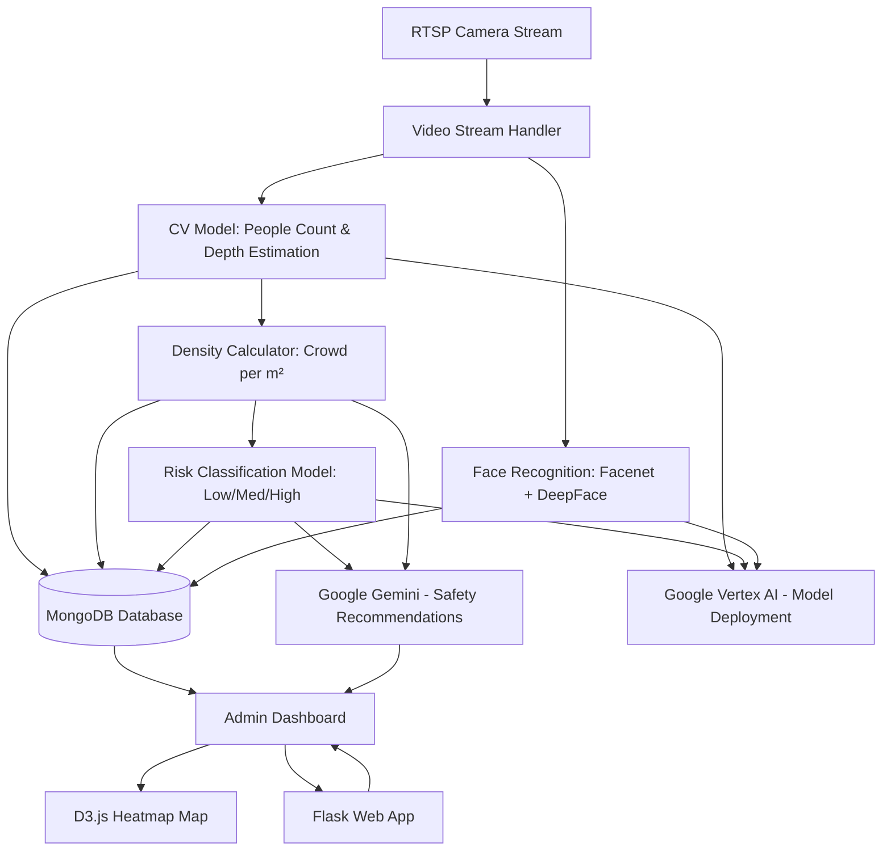

# DhristiAI - Google Hackathon Agentic AI

## 🧠 Project Brief: *AI-Powered Real-Time Crowd Risk Monitoring System*

### 🚧 Problem Statement:

Large public gatherings often lack real-time crowd density analysis and proactive risk management, leading to **stampedes, chaos, injuries, and even loss of lives**.

---

### 💡 Our Solution:

A smart surveillance system that:

* 🔴 **Detects crowd density per square metre** in real-time from RTSP video feeds.
* 🧠 **Classifies areas** into **Low, Medium, High risk** zones using deep learning.
* 🗺️ **Visualizes crowd hotspots** via live heatmaps (green/yellow/red) on an interactive map.
* 🧑‍🤝‍🧑 **Identifies missing persons** using facial recognition (FaceNet + DeepFace).
* 🤖 **Generates AI-driven crowd control instructions** using Google Gemini.
* 📈 All powered via **Flask backend**, **MongoDB**, **D3.js**, and **Google Vertex AI** for model serving.

---

### ✅ Real-World Relevance – The Facts That Matter:

#### 🚨 Crowd Disasters and Stampede Statistics:

* 💀 **Over 7,000 people have died in crowd crushes and stampedes** globally in the last two decades.
* 📍 In India alone, **over 1,100 people have died** due to stampedes in religious gatherings, political rallies, and public events since 2000.
* 🕋 **2015 Hajj stampede in Mecca** killed over **2,400 people** — one of the deadliest stampedes in recorded history.
* 🎉 **2008 Naina Devi Temple Stampede (India)**: Over **145 people died** due to uncontrolled crowd surge.
* 🏟️ **Kumbh Mela**: In 2013, a railway station crowd crush during the event killed **36 people** and injured over 100.
* 📊 According to *The Crowd Disaster Database*, **most incidents happen due to lack of real-time monitoring** and poor on-ground coordination.

> 🚨 **Stampedes are not caused by evil intent — they're caused by bad systems.**

---

### 🧬 Why Our Solution Matters:

> We’re not just building a tool — we’re building a **life-saving AI infrastructure**.

* It **detects danger before it becomes disaster**.
* It empowers ground staff with **instant recommendations**, not just static alerts.
* It bridges the gap between **human limitation and machine vision**.

## Architecture Diagram

## Tech Stack

### 📹 **Video & Stream Handling**

* **RTSP Protocol**: Used to stream real-time video from surveillance cameras to the backend for processing.

---

### 🧠 **AI/ML Models**

* **Custom Computer Vision Model**: Detects number of people and estimates area covered (square meter) to compute crowd density.
* **Risk Classification Model (Multi-class)**: Classifies regions as Low, Medium, or High risk based on crowd density and movement patterns.
* **FaceNet + DeepFace**: Used for face recognition to detect and identify missing persons in real-time from the video feed.
* **Google Vertex AI**: Manages, deploys, and scales ML models efficiently in the cloud without managing infrastructure manually.

---

### 🌐 **Backend & Web App**

* **Flask**: Lightweight Python web framework for building APIs and serving the admin dashboard, handling video stream routing and ML predictions.

---

### 🗺️ **Frontend & Visualization**

* **D3.js Maps**: Visualizes crowd density and risk zones on an interactive heatmap using color codes (Green/Yellow/Red).
* **Admin Dashboard (Custom UI)**: Allows admins to monitor live camera feeds, view risk levels, and take appropriate actions.

---

### 🧠 **AI Text Generation**

* **Google Gemini**: Generates safety recommendations and crowd control strategies for ground staff based on real-time risk data and crowd analysis.

---

### 🗄️ **Database**

* **MongoDB**: Stores processed video insights, crowd statistics, face recognition results, and historical risk zone data for retrieval and visualization.

## Features List

1. **Real-time People Detection** – Count the number of individuals in each video frame using custom computer vision.
2. **Crowd Density Estimation** – Calculate people per square meter using depth estimation techniques.
3. **Risk Zone Classification** – Identify and label areas as Low, Medium, or High risk based on density and movement.
4. **Heatmap Visualization** – Display crowd density on a map using color-coded heatmaps (Green/Yellow/Red).
5. **Face Recognition for Missing Persons** – Detect and identify known missing individuals using FaceNet and DeepFace.
6. **Safety Recommendations via Gemini** – Generate AI-based mitigation instructions for on-ground staff.
7. **Interactive Admin Dashboard** – Monitor live streams, view alerts, and control the system from a centralized UI.
8. **Video Stream Integration via RTSP** – Seamless real-time video capture from surveillance cameras.
9. **Data Storage with MongoDB** – Persist detection results, risk zones, and historical records.
10. **Cloud-based Model Deployment** – Host and manage ML models at scale using Google Vertex AI.

---

### 💡 Q1: How different is it from any of the other existing ideas?
Unlike traditional surveillance or passive camera monitoring, our solution actively interprets crowd behavior in real-time using AI. Most existing systems stop at video recording or basic motion detection — ours understands what’s happening. We combine live crowd density estimation, risk zone prediction, face recognition, and AI-driven safety recommendations all in one seamless dashboard. Plus, we don't just raise alerts — we generate intelligent actions, like suggesting how to decongest high-risk areas. It’s not just smarter — it’s proactive.

---

### 🧠 Q2: How will it be able to solve the problem?
Crowd mismanagement can lead to chaos, panic, or worse — fatalities. Our system solves this by analyzing video feeds in real time to measure how crowded an area is per square meter, automatically labeling zones as Low, Medium, or High risk. It then displays this visually on a map, and even uses Gemini AI to suggest actionable steps to ground staff — like "Redirect crowd from Gate A to Gate C" — making the response fast, contextual, and effective. It's like having an AI-powered command center watching every corner for you.

---

### 🚀 Q3: What’s the USP (Unique Selling Proposition) of your proposed solution?
AI that doesn’t just see — it thinks, guides, and protects.
Our USP lies in the fusion of real-time vision + intelligent recommendations. We’re not just analyzing the crowd, we’re guiding what to do next — using state-of-the-art models deployed on Vertex AI, live maps via D3.js, and even detecting missing persons using facial recognition. Add to that a beautiful, intuitive admin dashboard and live RTSP integration, and you get a powerful tool ready for deployment in public events, stadiums, stations, or smart cities.

---

## License

This project is licensed under the MIT License - see the [LICENSE](LICENSE) file for details.

## Hackathon Teammate
<table>
<tr>

<td align="center">
    <a href="https://github.com/khusburai28">
        <kbd></kbd> 
        <b>Khusbu Rai</b>
    </a> 
</td>

<td align="center">
    <a href="https://github.com/PushpenderIndia">
        <kbd></kbd> 
        <b>Pushpender Singh</b>
    </a> 
</td>

</tr>
</tr>
</table>
